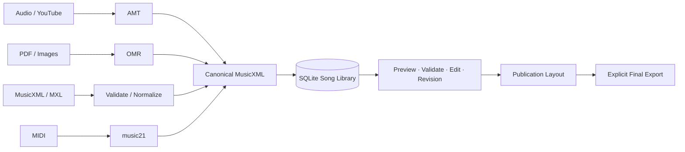

# AudioScoreTool

<p align="center">
  <strong>음원과 기존 악보를 편집 가능한 출판 악보로.</strong><br>
  Local-first automatic music transcription, OMR, score editing, validation, layout, and export.
</p>

<p align="center">
  <a href="https://github.com/JDeun/audio-score-tool/actions/workflows/ci.yml"></a>
  <a href="https://github.com/JDeun/audio-score-tool/actions/workflows/desktop-packages.yml"></a>
  <a href="LICENSE"></a>
  
</p>

> [!IMPORTANT]
> **현재 배포 상태:** 소스와 CI 기반 unsigned QA 패키지는 사용할 수 있지만, Windows Authenticode 서명과 macOS Developer ID notarization을 거친 **공식 signed public release는 아직 활성화 전**입니다. 실제 서명 배포 acceptance는 [#22](https://github.com/JDeun/audio-score-tool/issues/22)에서 추적합니다. unsigned CI artifact를 공식 검증 배포본으로 간주하지 마십시오.

> [!NOTE]
> **Desktop runtime 원칙:** 일반 사용자는 Python, Node.js, Rust, `pip`/`uv`, Homebrew/winget, MuseScore, LilyPond 같은 별도 개발도구나 악보 프로그램을 설치하지 않습니다. 핵심 runtime은 앱에 포함하고, 큰 AI/model·YouTube·OMR·검증 도구는 앱이 관리하는 component로 제공하는 방향입니다. 현재 어떤 component가 실제로 내장/관리되는지는 [의존성 정책](docs/DEPENDENCIES.ko.md)에 구분되어 있습니다.

AudioScoreTool은 처음부터 음표를 하나씩 입력하는 notation editor가 아닙니다. **AI/OMR 또는 기존 악보가 가능한 한 완성된 초안을 먼저 만들고, 사용자는 잘못된 부분과 출판 디테일을 수정하는 것**을 제품 원칙으로 합니다.

## 한눈에 보기

| 입력 | 처리 | Canonical 결과 |
|---|---|---|
| WAV/MP3 등 음원 | AMT + 선택적 코드/가사 분석 | MusicXML |
| YouTube URL | app-managed ingest stack → AMT | MusicXML |
| PDF/PNG/JPG/TIFF/BMP 악보 | optional OMR component | MusicXML |
| MusicXML/XML/MXL | 구조 검증·정규화 | MusicXML |
| MIDI | sidecar 내장 music21 | MusicXML |

생성된 악보는 **SQLite를 canonical state로 사용해 곡 단위로 관리**합니다. 미리보기·검증·편집·Revision·출판 조판을 거친 뒤 사용자가 `최종 파일 생성`을 실행할 때만 MusicXML/PDF/MIDI/파트보를 export합니다.



## 핵심 기능

- **다중 입력:** 로컬 음원, YouTube, PDF/이미지, MusicXML/MXL, MIDI
- **자동 채보:** 보컬·피아노/키보드·기타·베이스·드럼 등 감지 파트 생성
- **자동 보강:** 코드 진행 추정, MusicXML `<harmony>`, 선택적 Demucs + WhisperX 가사 정렬
- **앱 내 편집:** 음정/옥타브, accidentals, 음가, 쉼표, 마디, 조표·박자표, 가사·코드, tie/slur/beam, articulation
- **검증:** 결정론적 validator + 선택적 LLM critic. LLM은 자동 수정하지 않음
- **Revision:** DB 기반 Undo와 원본 복원
- **출판 조판:** 용지, 방향, 마디/시스템 수, 간격, 여백, 제목·크레딧 영역
- **최종 export:** Full Score MusicXML/PDF/MIDI 및 감지 파트별 MusicXML/PDF
- **로컬 우선:** 곡·Revision·분석·출판 설정은 로컬 SQLite에서 관리
- **독립 notation runtime:** MuseScore/LilyPond 없이 preview·MIDI·PDF export 수행

## 저장 모델

v0.8부터 `audio-score-tool.sqlite3`가 곡과 악보의 canonical state입니다.

```text
SQLite: audio-score-tool.sqlite3
├─ jobs
├─ songs
├─ song_revisions
├─ song_analysis
└─ publication_settings

Application Data/
├─ cache/          # 재생성 가능한 materialization
├─ assets/         # MIDI, OMR 원본 등 managed assets
├─ components/     # 앱이 소유하는 model/runtime/component
├─ jobs/           # 실행 workspace / history
└─ exports/        # 사용자가 명시적으로 만든 최종 결과
```

원본/현재 MusicXML, Revision, 분석 결과와 출판 설정은 DB에 두고, renderer/component가 요구하는 임시 MusicXML은 관리형 cache로 materialize합니다. 대용량 audio, stem, model checkpoint는 SQLite BLOB으로 저장하지 않습니다.

자세한 내용은 [저장 구조 문서](docs/STORAGE_V2.ko.md)를 참조하십시오.

## Notation backend

AudioScoreTool은 외부 notation application을 runtime fallback으로 호출하지 않습니다.

| 작업 | 기본 경로 | 전달 방식 |
|---|---|---|
| MusicXML 미리보기 | OpenSheetMusicDisplay | frontend bundle |
| MIDI ↔ MusicXML | music21 | Python sidecar |
| 파트 분리 | 자체 MusicXML 처리 | Python sidecar |
| MusicXML → vector PDF | Verovio → SVG → fpdf2 | Python sidecar |
| PDF/이미지 → MusicXML | OMR backend | app-managed optional component |

PDF와 파트 PDF는 **MusicXML → Verovio SVG → fpdf2 multi-page PDF**로 앱 내부에서 생성합니다. MuseScore, LilyPond, `musicxml2ly`를 설치하거나 fallback으로 사용할 필요가 없습니다.

## 채보 엔진 정책

공개 leaderboard의 단일 숫자보다 **실제 곡을 최종 악보로 만들 때 사람이 얼마나 수정해야 하는지**를 우선합니다.

### 개인 / 비상업

1. MuScriptor large — 품질 우선 후보
2. YourMT3+ — fallback
3. MR-MT3 — fallback 후보

MuScriptor 공개 weights는 **CC BY-NC 4.0**이므로 개인/비상업 모드에서만 허용합니다. 모델 파일은 Hugging Face 라이선스 수락 후 AudioScoreTool의 Python sidecar가 `huggingface_hub` API로 앱 관리 cache에 직접 다운로드합니다. 별도 `hf`/`uvx` CLI는 필요하지 않습니다. Hugging Face access token은 현재 앱 세션 메모리에만 유지하고 DB/설정 파일에 저장하지 않습니다.

### 상용

MuScriptor 공개 weights는 차단합니다. 실제 stable commercial provider는 고정 checkpoint/runtime의 상업 사용 및 재배포 provenance가 확인된 경우에만 공식 지원해야 합니다. YourMT3+/MR-MT3 후보의 정확한 revision/license는 release 단위로 고정·검토합니다.

자세한 근거와 benchmark 정책은 [엔진 성능 문서](docs/ENGINE_PERFORMANCE.ko.md), 배포 경계는 [의존성 정책](docs/DEPENDENCIES.ko.md)을 참조하십시오.

## Self-contained runtime 정책

### 설치본에 포함

- Tauri desktop shell
- React/TypeScript frontend + OSMD
- PyInstaller FastAPI sidecar
- SQLite
- music21
- Verovio
- fpdf2
- Hugging Face Hub download client

### 앱이 관리해야 하는 큰/선택 component

- AMT inference runtime + model weights
- Demucs / WhisperX
- YouTube ingest stack (`yt-dlp`, 필요한 FFmpeg/JS challenge runtime 포함)
- OMR backend(Audiveris를 유지한다면 필요한 JRE 포함)
- FFmpeg/ffprobe, FluidSynth, Chromaprint 등 선택 검증 도구

`managed component`는 **사용자가 brew/winget/pip로 직접 설치한다는 뜻이 아닙니다.** stable에서 해당 기능을 공식 지원하려면 앱이 version/checksum/license provenance와 install/update/remove lifecycle을 소유해야 합니다. 아직 delivery가 완성되지 않은 component는 준비됨으로 과장하지 않습니다.

## 시작하기

### 일반 사용자

목표이자 stable acceptance 기준은 **설치 파일 하나로 핵심 workflow가 동작하는 데스크탑 앱**입니다.

현재 GitHub Actions의 `Desktop Packages` workflow는 Windows `.exe`, macOS `.dmg`, Linux bundle을 QA용 artifact로 생성합니다. signed/notarized public installer는 [release activation #22](https://github.com/JDeun/audio-score-tool/issues/22) 완료 후 제공하는 것이 원칙입니다.

일반 사용자는 Python/Node/Rust/uv/pip, MuseScore/LilyPond, Homebrew/winget을 설치 절차로 사용하지 않습니다. 자세한 설치·component 계약은 [설치 가이드](docs/INSTALLATION.ko.md)와 [의존성 정책](docs/DEPENDENCIES.ko.md)을 참조하십시오.

### 개발자

source checkout 개발에만 다음 toolchain을 사용합니다.

- Python 3.12+
- `uv`
- Node.js 22 계열
- Rust toolchain (Tauri shell 개발 시)

```bash
git clone https://github.com/JDeun/audio-score-tool.git
cd audio-score-tool
uv sync --extra dev

cd desktop
npm ci
npm run desktop:dev
```

`.env.example`의 command override는 source/integration 개발용입니다. 일반 사용자 설치 계약이 아닙니다.

## 품질과 검증

AudioScoreTool은 happy-path unit test 통과를 “완료”로 간주하지 않습니다. v1 후보는 **입력·파일·API 인증·archive/parser·SQLite 상태·동시성·crash recovery·desktop shell·시각 계약을 의도적으로 깨뜨리는 adversarial gate**를 통과해야 합니다.

CI는 다음 계약을 자동 검증합니다.

- Python lockfile / Ruff
- **adversarial boundary & recovery gate** — stream upload cap, unsafe XML/MXL, compression bomb, artifact path/symlink escape, ambiguous local API credentials, corrupt historical state, concurrent SQLite writes, crash-recovery state
- 전체 Python pytest 회귀 suite와 malformed-input failure containment
- embedded Verovio/fpdf2 PDF integration
- packaged mode가 시스템 PATH의 executable을 사용하지 않는지 검증
- React/TypeScript typecheck + production build
- Chromium keyboard accessibility E2E
- **visual-contract E2E** — 지원 viewport overflow, dark-mode score paper, semantic selection/focus color, tactile micro-state, reduced motion
- Tauri/Rust `cargo check` + warnings-as-errors clippy
- 별도 Desktop Packages workflow의 Windows/macOS/Linux packaged sidecar smoke와 installer/bundle build

안정화 범위와 공격 표면은 [적대적 검증 문서](docs/ADVERSARIAL_VALIDATION.ko.md), UI의 미학 후보 비교·최종 디자인 시스템·시각 완료 기준은 [UI/UX 디자인 시스템](docs/UI_DESIGN.ko.md)을 참조하십시오.

제품 성능은 note F1만으로 판단하지 않습니다. instrument assignment, chord/lyrics, OMR error rate, real-time factor, peak VRAM과 함께 **사람이 수정한 양과 최종 편집 시간**을 핵심 KPI로 봅니다.

악보 검증은 결정론적 검사와 선택적 LLM critic을 분리합니다. LLM 판정은 `LLM 가설`이며 원음을 직접 측정하는 acoustic verifier로 간주하지 않고, 자동 수정 권한도 주지 않습니다.

## UI/UX 방향

AudioScoreTool의 UI는 특정 유행 스타일 하나를 그대로 적용하지 않습니다. Swiss/Editorial, contemporary pro-audio/notation workstation, industrial/instrument UI, Bauhaus/geometric modernism, HIG/Fluent, neumorphism, glassmorphism, skeuomorphism 등 여러 후보를 **가독성·장시간 피로도·고밀도 편집·브랜드 기억성·플랫폼 중립성** 기준으로 비교합니다.

현재 디자인 시스템은 다음 역할을 조합합니다.

- **Precision Editorial** — Management 화면의 grid, typography, spacing, 정보 위계
- **Pro Audio / Notation Workstation** — Studio의 graphite chrome, panel boundary, compact command surface, score-first workspace
- **Restrained Geometric Modernism** — app icon과 staff/waveform 브랜드 geometry
- **Print-first Paper** — 실제 악보 page는 장식보다 조판 fidelity를 우선

색상 의미도 분리합니다. muted olive는 브랜드/primary action, cobalt는 현재 편집 selection/focus를 나타냅니다. Neumorphic/glass/acrylic/skeuomorphic 표현은 global theme가 아니라 **상태 전달에 실제 도움이 되는 micro-interaction에만** 제한적으로 허용합니다.

## 릴리스 신뢰 모델

```text
source / PR
   ↓
adversarial gate + full CI + visual contract
   ↓
3-OS packaged smoke / desktop bundle
   ↓
self-contained clean-machine acceptance
   ↓
unsigned QA artifacts
   ↓
Windows signing / macOS signing+notarization
   ↓
checksums + signed updater metadata
   ↓
clean-install / update acceptance
   ↓
public stable release
```

stable acceptance에는 서명뿐 아니라 **system Python/Node/Rust/uv/pip가 없고, MuseScore/LilyPond가 없으며, Homebrew/winget 후설치가 없는 깨끗한 환경에서 핵심 import/edit/export가 동작하는지**도 포함합니다. 현재 운영 gate는 [#22](https://github.com/JDeun/audio-score-tool/issues/22)입니다.

## 문서

문서 전체 목록과 역할별 분류는 **[Documentation Index](docs/README.md)** 에 정리되어 있습니다.

주요 문서:

- [설치](docs/INSTALLATION.ko.md)
- [의존성/독립 실행 정책](docs/DEPENDENCIES.ko.md)
- [아키텍처](docs/ARCHITECTURE.ko.md)
- [저장 구조](docs/STORAGE_V2.ko.md)
- [악보 편집기](docs/EDITOR.ko.md)
- [PDF/이미지 OMR](docs/OMR.ko.md)
- [악보 검증](docs/VALIDATION.ko.md)
- [적대적 검증/안정화](docs/ADVERSARIAL_VALIDATION.ko.md)
- [UI/UX 디자인 시스템](docs/UI_DESIGN.ko.md)
- [엔진 성능/선택](docs/ENGINE_PERFORMANCE.ko.md)
- [릴리스](docs/RELEASE.ko.md)
- [제3자 모델·라이선스](docs/THIRD_PARTY_LICENSES.ko.md)

## 기여와 보안

- 기능 제안·버그 수정 절차: [CONTRIBUTING.md](CONTRIBUTING.md)
- 보안 취약점 보고 정책: [SECURITY.md](SECURITY.md)
- 버그와 기능 요청은 GitHub Issue templates를 사용해 주십시오.

큰 아키텍처 변경, 모델/라이선스 provenance 변경, canonical storage schema 변경은 구현 전에 Issue에서 범위와 근거를 먼저 합의하는 것을 권장합니다.

## 라이선스와 제3자 구성요소

AudioScoreTool 자체 코드는 [Apache License 2.0](LICENSE)으로 배포됩니다.

제3자 code/model/component에는 각자의 라이선스가 적용됩니다. 특히 MuScriptor weights의 비상업 제한, Verovio/fpdf2의 LGPL 의무, Audiveris의 AGPL 경계, FFmpeg 실제 build flags, AMT checkpoint provenance를 **실제 배포 artifact 기준으로** 확인해야 합니다.

상세 목록: [THIRD_PARTY_LICENSES.ko.md](docs/THIRD_PARTY_LICENSES.ko.md)

---

**v0.8 목표:** 자동 생성 결과를 파일 묶음으로 흩어 놓는 도구가 아니라, 한 곡을 생성 → 검증 → 수정 → Revision → 조판 → 최종 export까지 일관되게 관리하는 local-first 독립 데스크탑 악보 제작 환경.
